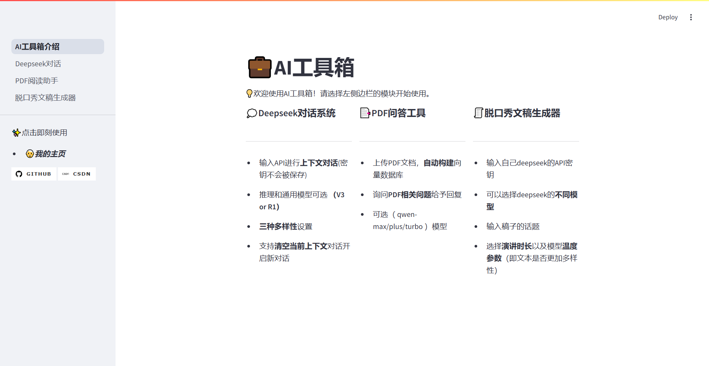
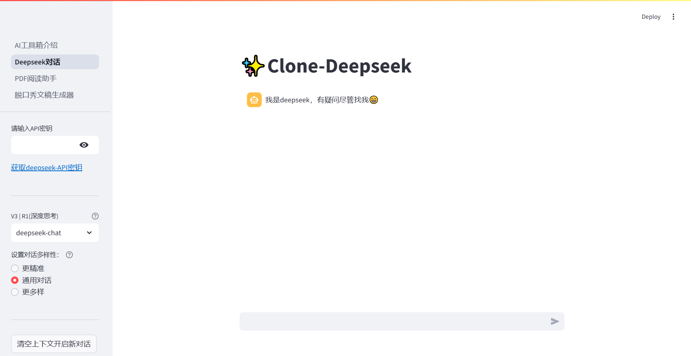
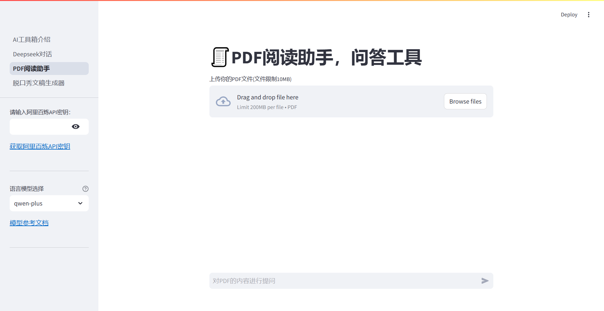
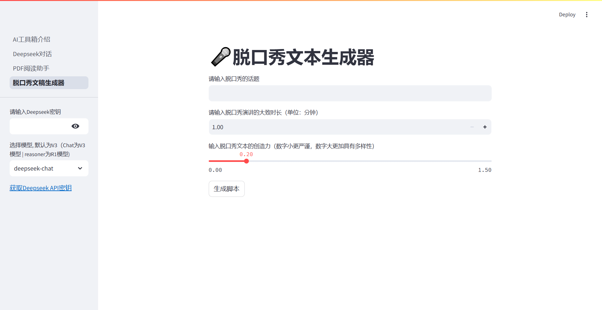

# AI工具箱
  
   
  
[](https://bailian.console.aliyun.com/)
[](https://github.com/Largzx/AI_ToolsKit)

### 🎬界面展示



# 📃系统依赖
| 类别                | 组件及版本                |
|---------------------|-------------------------|
| LLM集成            | langchain==0.2.17, langchain_openai==0.1.25 |
| 文本处理           | langchain-text-splitters==0.2.4, pypdf==5.3.1 |
| 向量存储           | faiss-cpu==1.8.0        |
| 深度学习框架       | transformers==4.46.3    |
| API服务            | dashscope==1.22.2       |
| Web交互框架        | streamlit==1.40.1       |


# 💭Clone deepseek
- 可以输入API进行多轮对话(密钥不会被保存)
- 可调模型类别（V3 or R1）
- 支持设置模型温度，即输出是否更加多样性
- 支持清空当前上下文对话开启新对话
---
可改进
- 上传文件问答
- 联网搜索
- 记录旧对话内容并可以返回查看
---

### 🎬界面展示




# 2.PDF问答工具
- 由于需要使用 LLM 模型和文本编码模型，因此使用了具有两种模型的阿里云百炼平台  
- 输入您的 APIKEY 并上传 PDF 文件并询问有关文件的问题

## 介绍

本项目主要使用 Langchain 和 streamlit 实现PDF问答。
你可以选择 qwen-max、qwen-plus、qwen-turbo 中的模型，这些模型的介绍你可以查看
以下链接  [阿里云百炼](https://help.aliyun.com/zh/model-studio/user-guide/text-generation/?spm=a2c4g.2712809.0.0.72731507x6iuVp)    
  
API创建网址 [百炼API](https://bailian.console.aliyun.com/?apiKey=1#/api-keyw)  


## 📑检索增强生成——RAG（Retrieval Augmented Generation）

 
- [x] ✅ RAG基础架构
- [X] 🌐 多语言支持

RAG 的步骤 :
1. 加载文件
2. 分割文件
3. 对分割后的文件进行嵌入编码
4. 将文本的嵌入向量存入向量数据库
5. 结合大模型和文本检索输出回答

## 📈 性能基准
### 模型对比
| 指标            | qwen-max | qwen-plus | qwen-turbo |
|-----------------|----------|-----------|------------|
| 首token延迟     | 650ms    | 320ms     | 180ms      |
| 复杂QA准确率    | 92.1%    | 87.5%     | 83.3%      |
| 上下文窗口      | 128k     | 30k       | 8k         |


## 🎬界面展示



# 🎤Deepseek脱口秀文稿生成器

使用deepseekAPI，构建后端方法，通过streamlit构建前端操作界面

- 输入自己deepseek的API密钥
- 可以选择deepseek的不同模型
- 输入稿子的话题
- 选择演讲时长以及模型温度参数（即文本是否更加多样性）
- 后期可以添加参数presence_penalty来使模型生成更多新词
---
>部署链接：https://talk-show-generate.streamlit.app/
---


## 🎬界面展示




## 🚀 快速部署
### 环境配置
```bash
# 安装核心依赖
pip install -r requirements.txt 
```

### 启动项目
```bash
# 进入项目根目录文件
cd ./API_toolkit
# 运行Streamlit前端界面
streamlit run ./AI工具箱介绍.py
```


